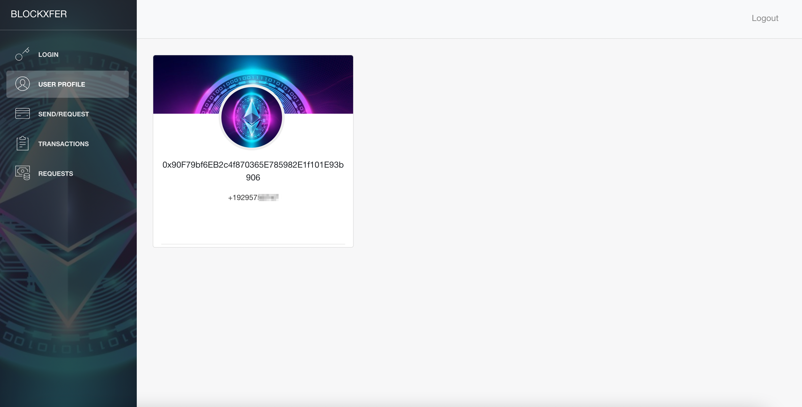
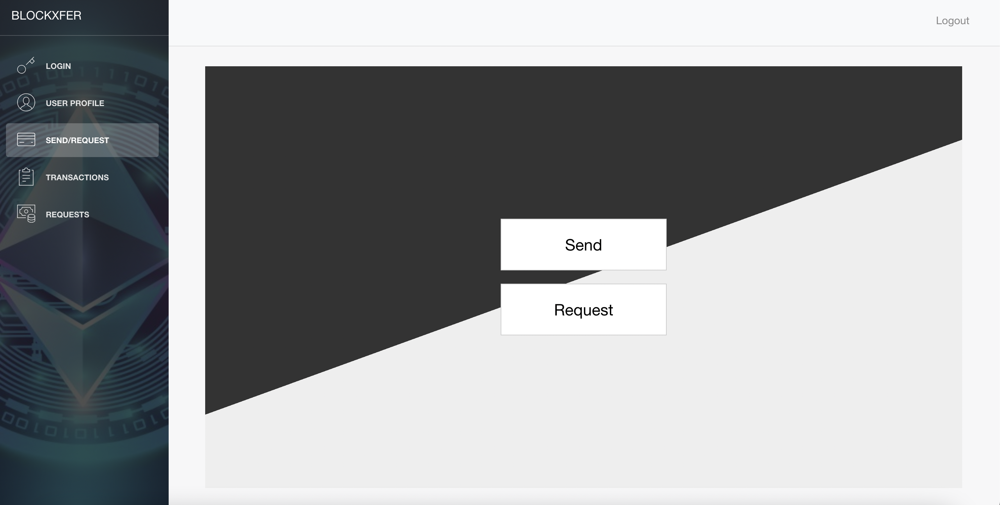
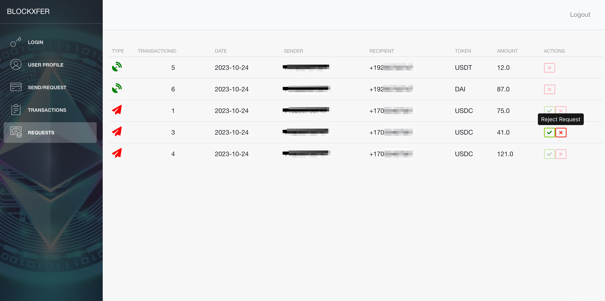

# BlockXfer Documentation

## Table of Contents
- [BlockXfer Documentation](#blockxfer-documentation)
  - [Table of Contents](#table-of-contents)
  - [Overview](#overview)
  - [Features](#features)
  - [Tech Stack](#tech-stack)
  - [Future Updates](#future-updates)
  - [Backend Functionality](#backend-functionality)
  - [Screenshots](#screenshots)
  - [Demo Video](#demo-video)
  - [Getting Started](#getting-started)
    - [Environment Setup](#environment-setup)
      - [Update the Following Files:](#update-the-following-files)
    - [Running Locally](#running-locally)
      - [Frontend:](#frontend)
      - [Backend:](#backend)
      - [Smart Contracts:](#smart-contracts)

## Overview

BlockXfer is a cryptocurrency transfer platform that allows one to send or request digital assets using the recipient's phone number. The platform relies on a two-way mapping between phone numbers and hexadecimal identifiers, known as public addresses, which are stored in IPFS.


## Features

- **Transfer Assets**: Seamlessly send digital assets between two registered users.
- **Request Assets**: Request assets from either registered or unregistered users.
- **Escrow Functionality**: Securely holds assets for unregistered users until they complete the registration process.

## Tech Stack

Built with the following technologies:

- Solidity
- Hardhat
- ReactJS
- Nodejs
- OpenZeppelin
- Twilio SDK
- IPFS

## Future Updates

- Bridging assets to different EVM chains.
- Redirecting escrowed assets to financial markets like Aave and Compound Finance.

## Backend Functionality

The Node.js backend application is responsible for:

1. Mapping phone numbers to blockchain addresses and vice versa.
2. Verifying phone numbers and registering users.
3. Acting as a middleware between the frontend and blockchain contracts.

## Screenshots









## Demo Video

- https://youtu.be/2AuXJPNly24


## Getting Started

### Environment Setup

#### Update the Following Files:

1. `.env` file in the `Backend-Server` folder:
    - `SECRET_ENCRYPTION_KEY`
    - `TWILIO_ACCOUNT_SID`
    - `TWILIO_AUTH_TOKEN`
    - `TWILIO_VERIFY_SID`
    - `TWILIO_PHONE_NUMBER`
    - `DEPLOYED_PHONE_CONTRACT_ADDRESS`
    - `RPC_URL`

2. `.env` file in the `Backend-Contracts` folder:
    - `SECRET_ENCRYPTION_KEY`

3. Create `Backend-Server/ipfsData/backup.txt`: The IPFS URI will be stored and constantly updated here.

### Running Locally

#### Frontend:
```bash
cd Frontend
npm install
npm start
```

#### Backend:
```
cd Backend-Server
npm install
node app.js
```

#### Smart Contracts:
If you wish to run this in your development environment, generate the contract ABIs by executing the following commands:
```
cd Backend-Contracts
npx hardhat compile
```